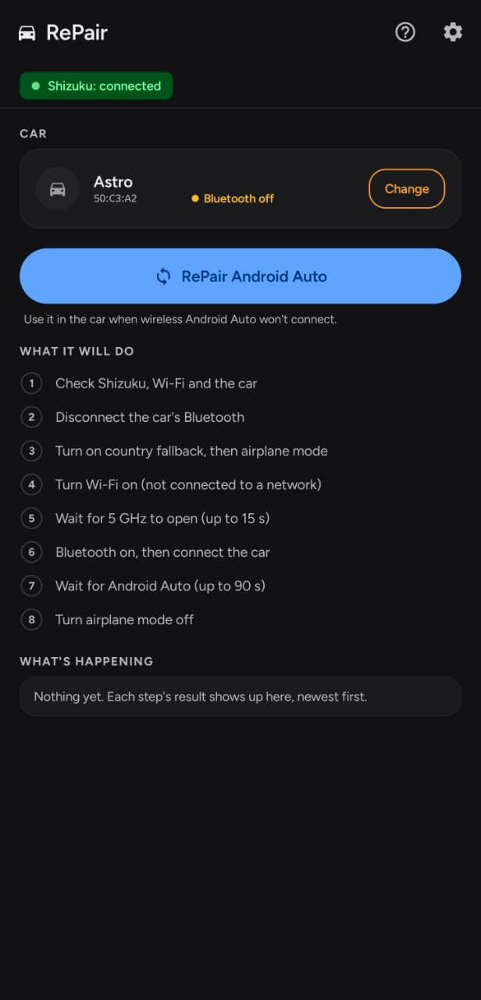

# RePair 🚗📶

**Your car's wireless Android Auto won't connect? RePair fixes it with one tap.** No root needed.

[⬇️ Download the latest version](../../releases/latest) · [What's new](CHANGELOG.md)

> **Why I made RePair:** I built it to fix wireless Android Auto on my own Samsung Galaxy S24
> Ultra (Android 16), and that's the phone it's tested on. I'm sharing it because it could be
> useful on other Samsung phones with the same problem, and maybe on other phones too.
>
> Feel free to try it! Just keep in mind there are no plans to support other devices, so if it
> doesn't work on yours, it may stay that way.

  

## Why doesn't it connect? 🤔

Wireless Android Auto talks to your car over 5 GHz Wi-Fi. Your phone decides which Wi-Fi channels
it's allowed to use based on the country of the mobile network it sees. In some countries (Egypt,
for example) the channel some cars use, like channel 149 on Renault, isn't on that list. So the
phone simply can't see the car's Wi-Fi, and Android Auto waits forever.

## What RePair does ✨

With one tap, RePair makes your phone forget the mobile network's country for a moment. Wi-Fi then
switches to your phone's own fallback country (for example India), and the 5 GHz channels open up.
RePair reconnects the car, waits for Android Auto to connect, and turns your mobile network back on.

And the best part: Android Auto keeps working after that, because the phone doesn't change the
Wi-Fi country while it's connected.

A run takes about 30 seconds (up to 2 minutes if your car is slow to wake up).

**It plays safe, too:**
- If anything goes wrong, or you tap Stop, airplane mode is turned back off so you never lose your
  mobile signal.
- If Android Auto is already connected, RePair doesn't touch anything.

## Will it work for you? ✅

RePair doesn't add anything new to your phone: it automates a trick that already works by hand.
So before installing it, it's worth checking that the trick works for you. Two things must be true:

**1. Your car and your phone must support wireless Android Auto.** RePair can't add wireless
Android Auto to a car or a phone that doesn't have it. It only helps when the only thing in the
way is the Wi-Fi country.

**2. Your phone's region must be a country where wireless Android Auto works.** On Samsung this
is the phone's CSC (region software), for example **INS** (India). When the mobile signal is gone,
the phone falls back to this region's Wi-Fi rules, and that's what opens the car's 5 GHz channel.
If your phone's region is the same country that blocks the channel, neither the manual way nor
RePair will help.

### Test it by hand first (no app needed)

1. Turn on **airplane mode**.
2. **Restart the phone.** It comes back still in airplane mode, without ever seeing the mobile
   network, so Wi-Fi follows your phone's own region instead.
3. Turn **Bluetooth** and **Wi-Fi** back on (airplane mode stays on).
4. Start the car and let **wireless Android Auto** connect.
5. Once Android Auto is running, turn **airplane mode off**. Your mobile signal comes back, and
   Android Auto keeps working.

**If this works, RePair will work for you too**, and it does all of it with one tap, with no
restart. If Android Auto doesn't connect even this way, the problem is something RePair can't
fix (the car, the phone, or the phone's region).

## What you need 📋

- Android 12 or newer.
- [Shizuku](https://shizuku.rikka.app/) installed and running. It needs a quick restart after
  every phone reboot.
- A phone region (CSC) whose country allows your car's channel, like **INS** (India). Don't worry,
  RePair checks this for you.
- Your car paired with your phone over Bluetooth.

## Getting started 🚀

1. Download `RePair-x.y.z.apk` from [Releases](../../releases/latest) and install it. If Android
   asks, allow installing from your browser or file manager.
2. Open Shizuku and tap **Start** (with Wireless debugging).
3. Open RePair and allow the Shizuku permission.
4. Tap **Choose**, allow Nearby devices, and pick your car.
5. That's it! The checklist on the main screen tells you if anything is still missing.

## Five ways to run it 🎛️

- **The big button** in the app: *RePair Android Auto*. You can watch every step live, with a log.
- **Quick Settings tile**: edit your Quick Settings panel and add the *RePair* tile. One tap and it
  runs in the background (your phone needs to be unlocked).
- **App shortcut**: long press the RePair icon, then *Run RePair in the background*.
- **Samsung Modes and Routines**: add an action: Apps, *Open an app or do an app action*, RePair,
  *Run RePair in the background*. It runs quietly without opening the app. Great for running it automatically when you get in the car!
- **Tasker**: the *RePair* plugin action gives you:
  - `%repair_status`: `success`, `skipped` (Android Auto was already connected) or `fail`
  - `%repair_result`: the final message, or why it failed
  - `%repair_airplane`: `true` if the run used airplane mode, `false` if it stopped before that
  - plus *Check status*, which reads `%repair_country`, `%repair_5ghz` and `%repair_fallback`
    without changing anything.

Want to know how a background run went? Turn on a toast or a notification in **Settings, Run
results**.

## Settings ⚙️

- **Turn off Wi-Fi if connected** (off by default). Without it, a connected Wi-Fi stops the run.
- **Block saved networks during the run** (needs the switch above). Keeps the phone from jumping
  onto your home Wi-Fi or a hotspot during the run.
- **Run results**: a toast and a notification, each set to Off, Failures only or Always.
- **Theme**: Light, Dark or System.

## Handy tips 💡

- **Samsung users**: switching USB to file transfer can stop Shizuku. To avoid that, dial
  `*#0808#` in the Phone app and choose **MTP + ADB**.
- Stuck? The **Help** screen inside the app explains every step and every error message.
- **Updates**: when a new version is out, RePair tells you once when you open it, and a dot on the
  **ⓘ** button reminds you until you update. You can also check any time from **ⓘ** or
  **Settings, About** ([releases page](../../releases/latest)).

## Privacy and battery 🔋

- RePair only goes online to **check GitHub for a newer version** when you open the app. Nothing
  about you or your phone is sent, and runs from the tile, Routines or Tasker never go online.
- Nothing runs in the background unless you start a run. The tile and the shortcut don't keep
  anything running either.
- The log lives in memory only and is gone when you close the app.

## Use at your own risk ⚠️

RePair switches your phone's airplane mode, Wi-Fi and Bluetooth while it runs. It's built to
always put things back, but it comes with no warranty: you use it at your own risk.

## Credits 💙

RePair is built with these great open-source projects:

- [Shizuku](https://github.com/RikkaApps/Shizuku-API) by RikkaW, [Apache License 2.0](licenses/Apache-2.0.txt)
- [AndroidX and Jetpack Compose](https://developer.android.com/jetpack) by Google, [Apache License 2.0](licenses/Apache-2.0.txt)
- [Kotlin coroutines](https://github.com/Kotlin/kotlinx.coroutines) by JetBrains, [Apache License 2.0](licenses/Apache-2.0.txt)
- [Figtree font](https://github.com/erikdkennedy/figtree) by Erik Kennedy, [SIL Open Font License 1.1](licenses/Figtree-OFL.txt)

## License 📄

RePair is free to download and use. Please share a link to this page rather than the APK itself,
and don't modify or resell the app. The full terms are in [LICENSE](LICENSE).

## About 👋

RePair is made by Bassem Baraya, born out of a Renault that refused to talk to an Egyptian phone.
This repository holds the app's releases and notes; the source code isn't published.

Found a bug on the S24 Ultra? [Open an issue](../../issues) with what happened
(a screenshot of the log helps a lot), or email me at
[mcbaraya.dev@gmail.com](mailto:mcbaraya.dev@gmail.com). Thanks for trying it! 🙌
